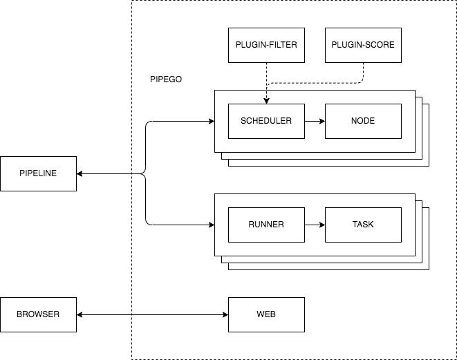
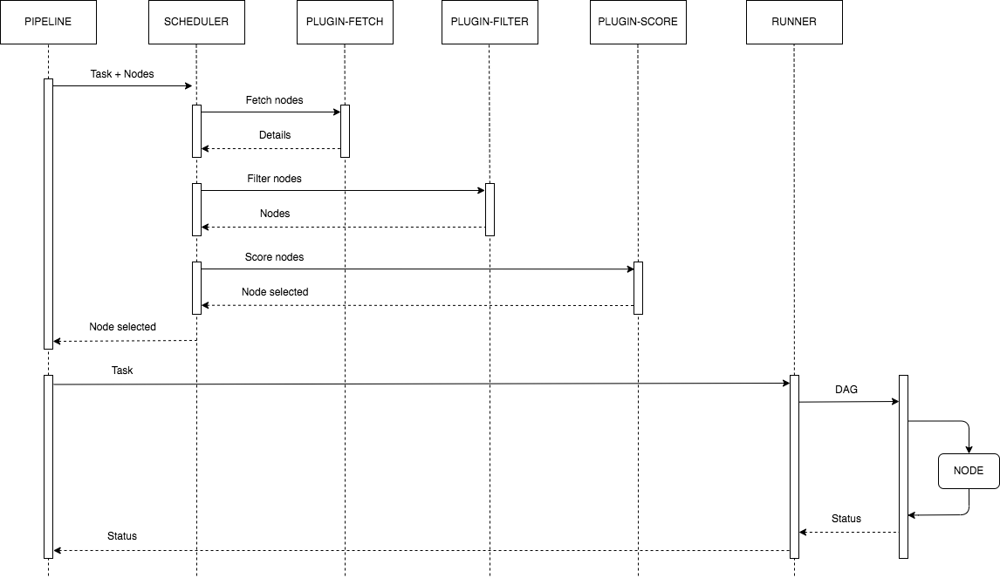

# deploy

[](https://github.com/pipego/scheduler/blob/main/LICENSE)


## Introduction

*deploy* is the deployment of [pipego](https://github.com/pipego).


## Diagram




## Flow




## Deploy

```bash
cd script

# Start
./deploy.sh start

# Stop
./deploy.sh stop

# Clean
./deploy.sh clean
```


## Test

```bash
cd script

# Docker mode
./test.sh docker pull
./test.sh docker run

# Host mode
./test.sh host pull
./test.sh host run
```


## License

Project License can be found [here](LICENSE).
