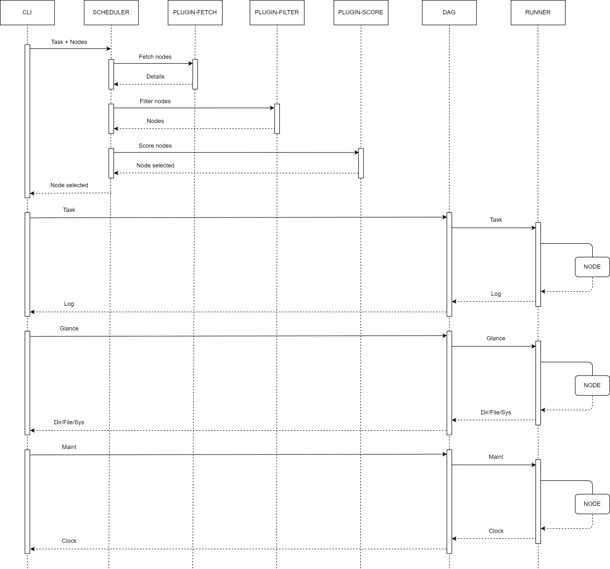

# deploy

[](https://github.com/pipego/deploy/blob/main/LICENSE)


## Introduction

*deploy* is the deployment of [pipego](https://github.com/pipego).


## Diagram


## Flow




## Run

### Runner

```bash
git clone https://github.com/pipego/runner.git
cd runner/
make build
./bin/runner --listen-url=:29090
```


### Scheduler

```bash
git clone https://github.com/pipego/scheduler.git
cd scheduler/
make build
make plugin
cp config/config.yml bin/
cd bin/
./scheduler --config-file=./config.yml --listen-url=:28082
```


### CLI

```bash
git clone https://github.com/pipego/cli.git
cd cli/
make build
./bin/cli --config-file=./test/config/config.yml --runner-file=./test/data/runner.json --scheduler-file=./test/data/scheduler1.json
```


## License

Project License can be found [here](LICENSE).
