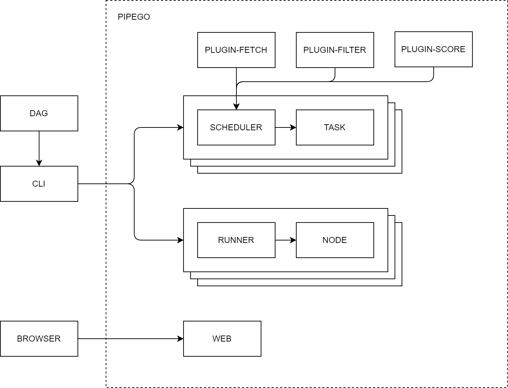

# deploy

[](https://github.com/pipego/scheduler/blob/main/LICENSE)


## Introduction

*deploy* is the deployment of [pipego](https://github.com/pipego).


## Prerequisites


## Diagram




## Flow


## Run

```bash
TBD
```


## Docker

```bash
TBD
```


## License

Project License can be found [here](LICENSE).


## Reference
